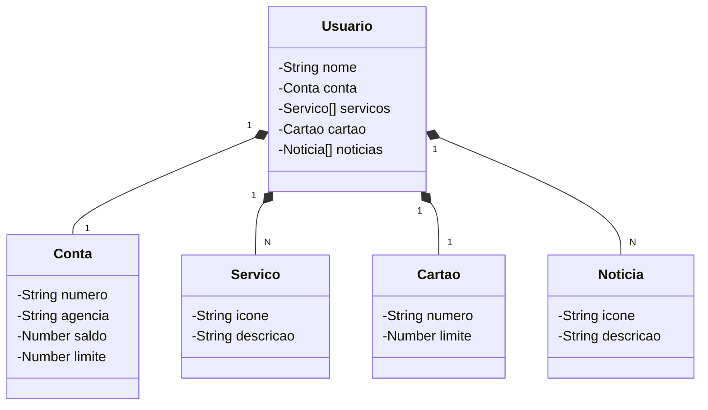

## Banco Nimbus

Projeto de Banco em nuvem

## Diagrama de Classes (Domínio da API)

```mermaid
classDiagram
  class Usuario {
    -String nome
    -Conta conta
    -Servico[] servicos
    -Cartao cartao
    -Noticia[] noticias
  }

  class Conta {
    -String numero
    -String agencia
    -Number saldo
    -Number limite
  }

  class Servico {
    -String icone
    -String descricao
  }

  class Cartao {
    -String numero
    -Number limite
  }

  class Noticia {
    -String icone
    -String descricao
  }

  Usuario "1" *-- "1" Conta
  Usuario "1" *-- "N" Servico
  Usuario "1" *-- "1" Cartao
  Usuario "1" *-- "N" Noticia
```
